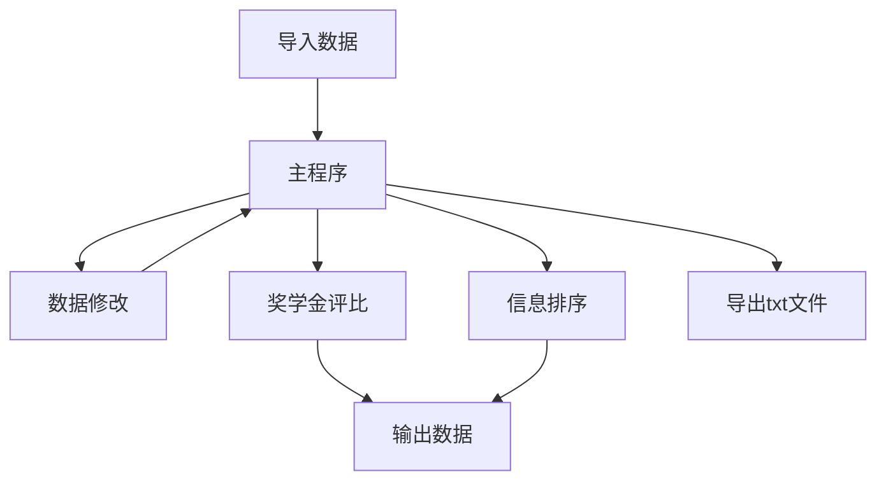
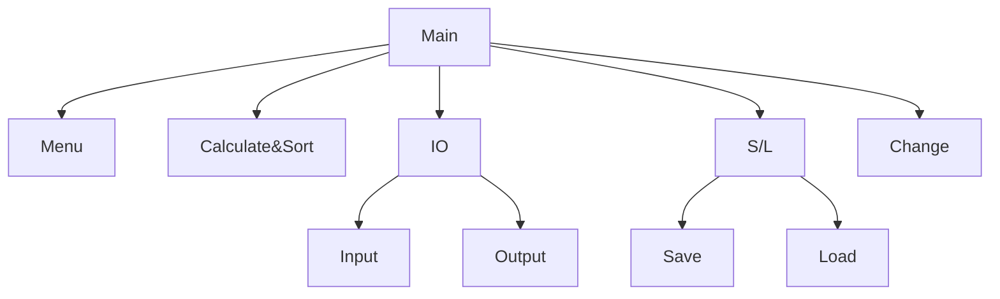
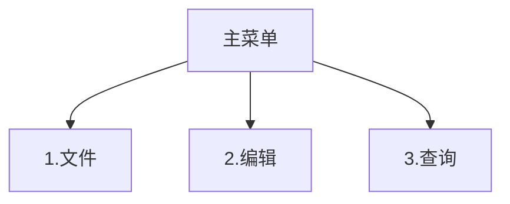
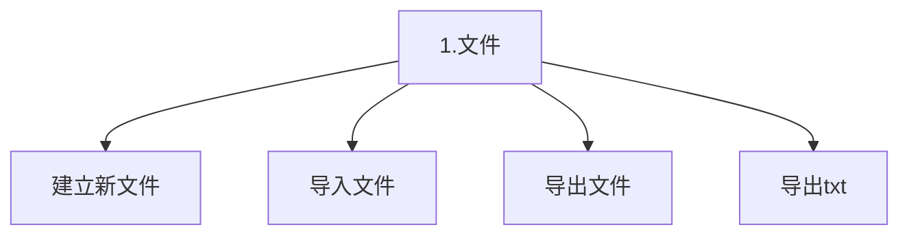
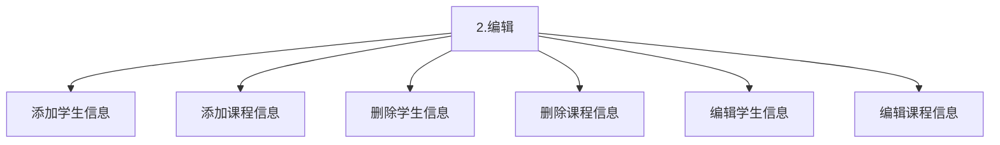
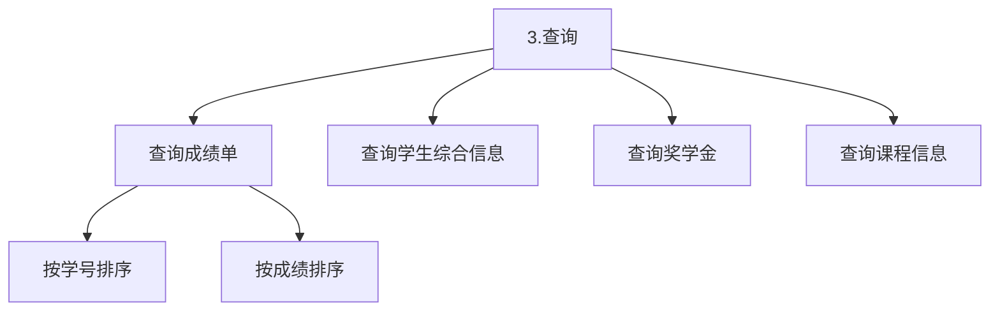

# 学生信息管理系统

##  一、系统分析

1. 存储学生信息
2. 存储课程信息
3. 存储成绩信息
4. 存储综合信息
5. 信息排序
6. 奖学金评比

## 二、系统设计

### 1.流程图

### 2.功能模块图

### 3.数据结构设计

1. 学生数据结构
   + 姓名
   + 学号
   + 宿舍号
   + 性别
   + 年龄
   + 所修课程
     - 课程号
     - 课程得分
     - 重修标记
   + 奖惩信息
     - 奖励/惩罚
     - 奖惩信息
     - 奖惩得分
2. 课程数据结构
   * 课程号
   * 课程名称
   * 课程学期

### 4.菜单结构设计

### 5.输入输出设计

### 6.文件结构设计

### 7.代码规范化设计

## 三、测试

## 四、运行界面

## 五、总结

## 六、开发日志

02.19 进行菜单设计，实现方向键选择菜单，空格确认，esc 键退出功能。

02.22 完善菜单，实现学生、课程、奖惩结构体